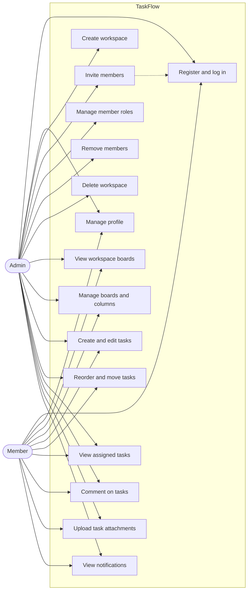
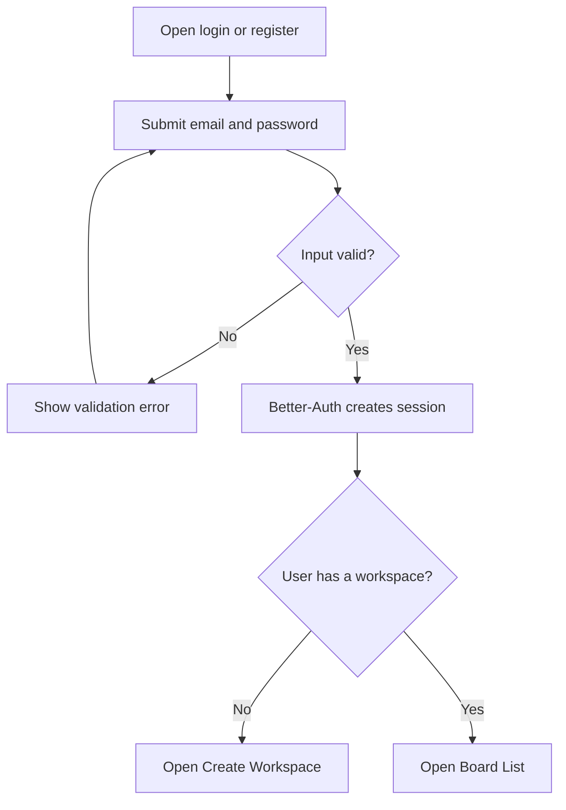
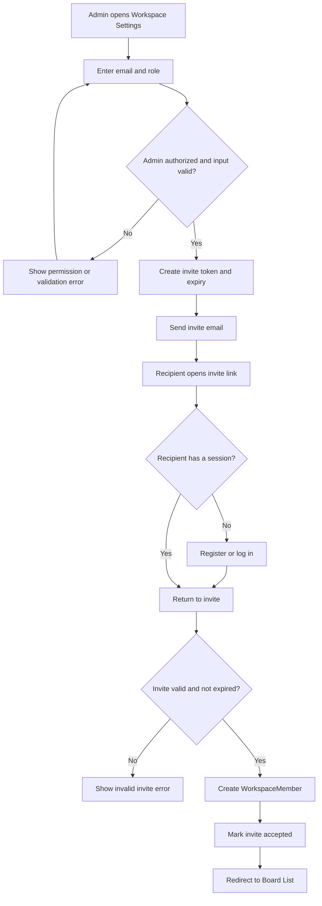
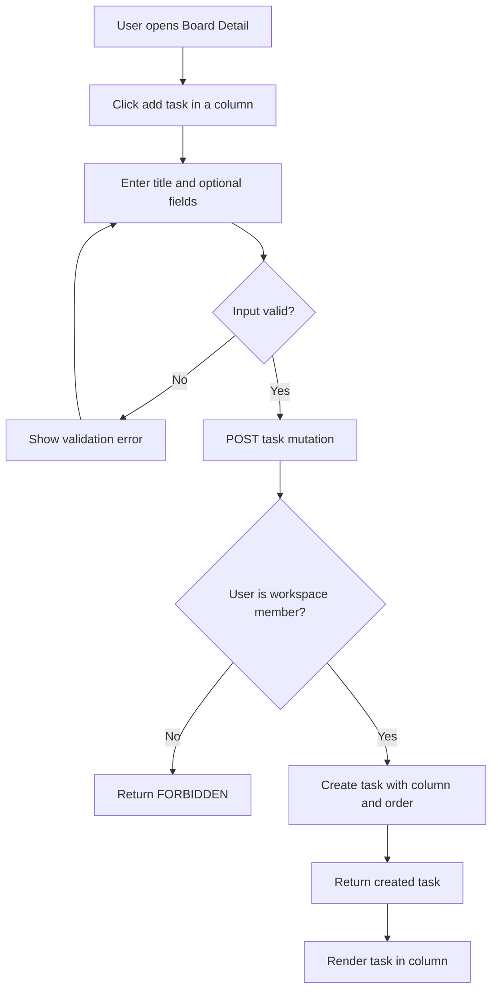
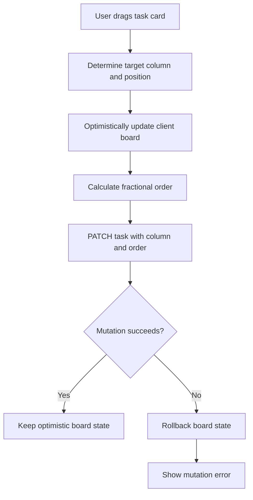
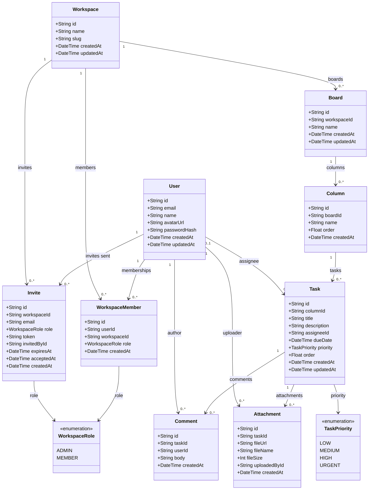

# TaskFlow Phase 0 Diagrams

These diagrams describe the MVP scope in `PRD.md` before implementation begins.

## Use Case Diagram

`Admin` has the same task and collaboration capabilities as `Member`, plus workspace
and membership administration capabilities.

## Process Flowcharts

### Authentication

### Invite and Accept

### Task Creation

### Drag-and-Drop Reorder

## Class Diagram

The relationships and nullable fields mirror `PRD.md` §10.2. Deleting workspace-owned
records cascades; deleting an assignee sets `Task.assigneeId` to `null`.
