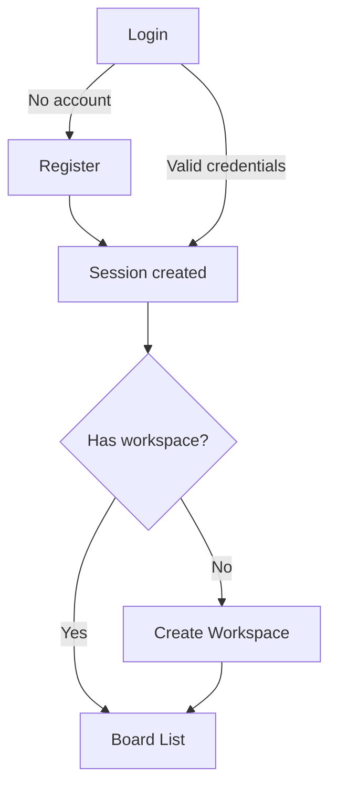
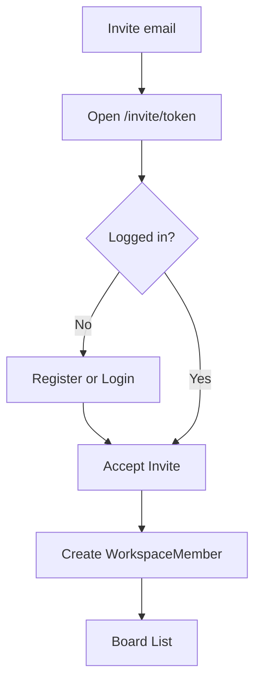
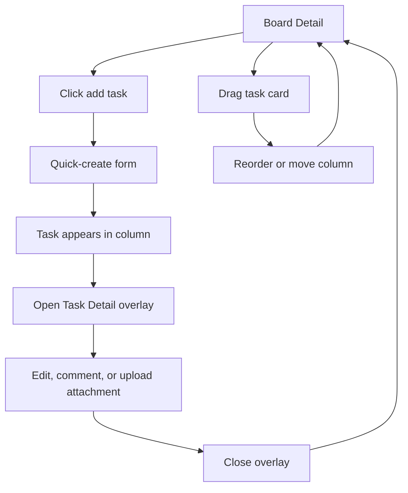
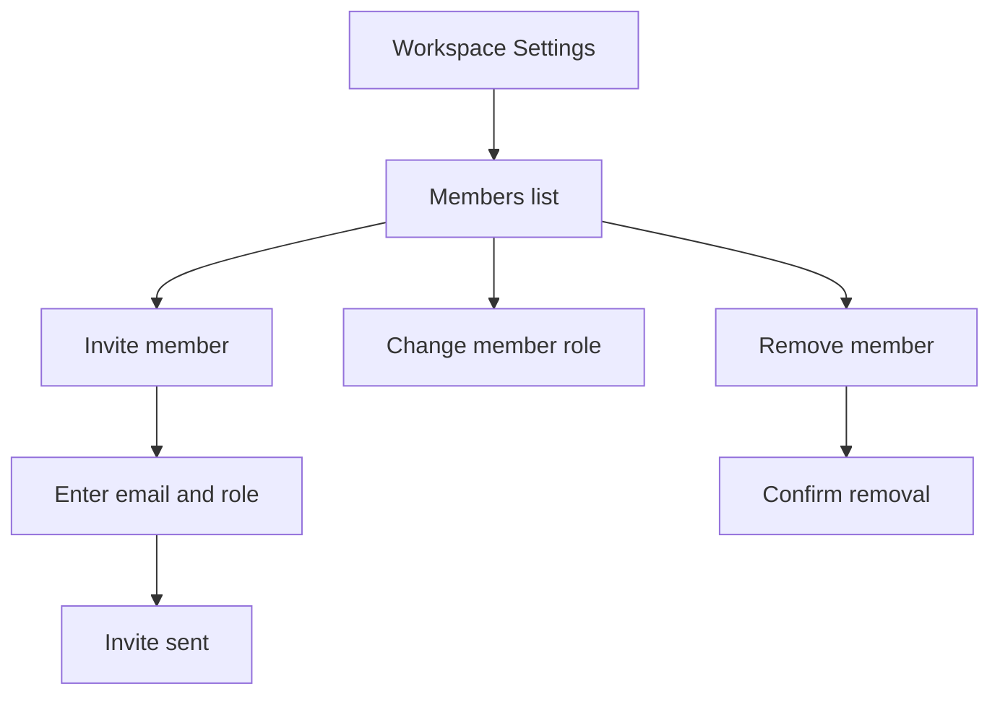
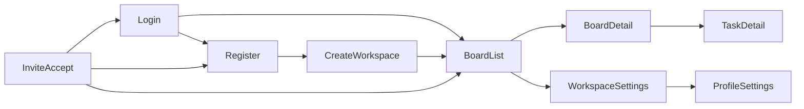

# TaskFlow UI and Screen Flow

This document defines the MVP screen inventory and navigation before implementation.
It complements `PRD.md`, `AGENTS.md`, and `DESIGN.md`.

## Screen Inventory

| Screen | Route | Access | Purpose |
| --- | --- | --- | --- |
| Login | `/login` | Public | Sign in |
| Register | `/register` | Public | Create an account |
| Create Workspace | `/workspaces/new` | Authenticated | Create the first workspace |
| Board List | `/[workspaceSlug]/boards` | Workspace member | List workspace boards |
| Board Detail | `/[workspaceSlug]/boards/[boardId]` | Workspace member | Use the Kanban board |
| Task Detail | Overlay on Board Detail | Workspace member | Edit task, comments, and attachments |
| Workspace Settings | `/[workspaceSlug]/settings` | Member; admin for mutations | Manage members, roles, and invites |
| Invite Accept | `/invite/[token]` | Public, then authenticated | Accept an invitation |
| Profile Settings | `/settings/profile` | Authenticated | Update name and avatar |

## Primary User Flows

### Authentication

### Invite and Join Workspace

### Kanban Task Lifecycle

### Workspace Administration

## Sitemap

## Required Screen States

Data-fetching and mutation screens must define these states:

- Loading: initial data or mutation is in progress.
- Empty: no boards, tasks, or members exist yet.
- Error: fetch or mutation failed.
- Permission denied: a member attempts an admin-only action.

## Confirmed Assumptions

- Task Detail is an overlay on Board Detail so board context remains visible.
- Password reset is outside the MVP scope.
- A user without a workspace goes to Create Workspace after authentication.
- Board List and Create Workspace are dashboard routes and should be reflected in the
  implementation folder structure when Phase 1 begins.
